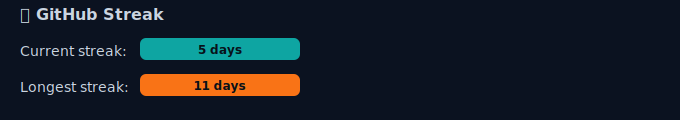

<!-- Header -->
<h1 align="center">👋 Hi, I'm Ganesh Ghode</h1>
<h3 align="center">💻 Full-Stack Developer (MERN) | DevOps & System Design Learner | India 🇮🇳</h3>

  <!-- Replace with your own hosted GIF or image if you prefer -->
  

---

## 🚀 About Me
- 🔭 I build **full-stack, scalable and production-level projects**
- 🌱 Currently learning **Advanced Backend, DevOps, Kubernetes, AWS, CI/CD**
- 🧠 Strong in **React, Node.js, MongoDB, Next.js, WebRTC**
- 💬 Ask me about **JavaScript, React, DevOps, APIs, System Design**
- 📫 Reach me at: **ganeshghode2002@gmail.com**

---

# 🌐 Connect With Me

  
  
  

---

# 🛠️ Tech Stack

  

---

# 📊 GitHub Stats

  
  

---

## 🔥 GitHub Streak (dynamic, may be down)

  

<!-- Fallback: static image hosted in this repo (never breaks) -->
<!-- 

  

 -->
---

# 📈 Contribution Graph (reliable fallback)

  <!-- ghchart is a stable heatmap SVG generator -->
  

---

# 🏆 GitHub Achievements

  

---

# 🚀 Featured Projects
### 🎧 **Spotify Clone – React + Tailwind**
Modern fully responsive UI, Sidebar, Player, Playlist, Theme Toggle.

### 🗳️ **Voting App – Node.js + MongoDB + JWT**
Secure API-based backend with authentication.

### 👨🏻‍💻 **Job Portal – MERN**
Full-stack app with authentication, recruiter dashboard, job posting.

---

# ⭐ Fun Quote
> “Always building. Always learning. Always improving.”

---

